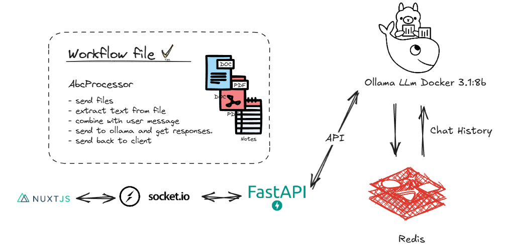

# **ADEO Solution Documentation: Streamlining Internal Workflows**



## **Problem Description**

### **Challenge 1: Streamlining Internal Opinion Request Processes**

**Problem Statement**:  
The current method for handling Internal Opinion Requests is fragmented and inefficient. Departments receive documents requiring analysis and provide opinions based on individual expertise, existing strategies, historical context, and relevant documents. This process leads to inconsistent responses, duplicated efforts, and a lack of standardized formatting in summarizing asks, analyses, and recommendations. There's a critical need for a unified system that streamlines this process, ensures consistency across departments, and leverages collective knowledge efficiently.

---

## **Overview**

> [info]
> This sulutions is full offline and does not require any internet connection to run only the first time to download the docker images.

This documentation provides a detailed guide to deploying and running the ADEO solution, designed for the **InnovateAI: Streamlining Internal Workflows Hackathon**. The solution addresses challenges in automating internal workflows and research tasks.

### **Key Technologies**

1. **Frontend**: Built with Nuxt.js (SSR) and styled using TailwindCSS.
2. **Backend**: Powered by FastAPI with real-time WebSocket capabilities via Socket.IO.
3. **AI Model**: Ollama’s `llama3.1:8b`, deployed using Docker.
4. **Database**: Redis is used for storing chat history efficiently in memory, enabling fast access and updates.

> **Callout**: The current configuration uses Ollama with **CPU by default**. If you want to enable GPU acceleration, refer to the [Ollama GPU Setup Guide](https://hub.docker.com/r/ollama/ollama) for instructions on configuring GPU support in Docker.

---

## **Redis for Chat History**

Redis is used to store and manage chat history, ensuring efficient handling of conversation data. It acts as an in-memory database, providing low-latency access to historical messages for quick retrieval and updates during interactions.

- **Usage**:
  - Incoming and outgoing messages are stored as key-value pairs in Redis.
  - Redis keys are structured to manage multiple conversations or user-specific histories.

- **Redis Configuration**:
  Redis is configured in the `docker-compose.yml` file and runs on port `6379`. Ensure it is running alongside other services.

---

## **Using a Different Model**

If you want to use a different AI model with Ollama, you can customize it by editing the following file in the backend service:

**File Path**: `api/app/service/ollama_service.py`

Locate the `payload` dictionary in the file:

```python
payload = {
    "model": "llama3.1:8b",
    "messages": existing_history,
    "stream": False,
}
```

### **Steps to Change the Model**:

1. Replace `"llama3.1:8b"` with the name of the model you want to use.
   - Example: `"model": "your-preferred-model-name"`

2. Save the changes and restart the backend service.

### **GPU Support**:

To enable GPU usage for Ollama, follow the instructions provided in their official documentation:  
[Ollama Docker GPU Setup Guide](https://hub.docker.com/r/ollama/ollama)

---

### **Additional Resources**:

1. **Ollama API Documentation**:  
   For details on using the Ollama API, refer to the [Ollama API Documentation](https://github.com/ollama/ollama/blob/main/docs/api.md).

2. **Model Library**:  
   Browse and select from a variety of models in the [Ollama Model Library](https://ollama.com/library).

---

## **Prerequisites**

Ensure the following tools are installed:

- **Docker**: [Install Docker](https://www.docker.com/products/docker-desktop)
- **Docker Compose**: [Install Docker Compose](https://docs.docker.com/compose/install/)
---

## **Step 1: Clone the Repository**

Clone the project repository to your local machine:

```bash
git clone <your-project-repository-url>
cd <your-project-directory>
```

---

## **Step 2: Running the Solution**

1. **Start Services**:
   Use Docker Compose to build and start all services:
   ```bash
   docker-compose up --build
   ```

2. **Verify Running Containers**:
   Check that all containers are running and retrieve the **CONTAINER ID** for the Ollama container:
   ```bash
   docker ps
   ```
   Look for the container with the `IMAGE` name `ollama/ollama` in the output and note its **CONTAINER ID**.

3. **Initialize the Ollama Model**:
   After all services are up, ensure the **Ollama model** (`llama3.1:8b`) is operational by running:
   ```bash
   docker exec -it <CONTAINER_ID> ollama run llama3.1:8b
   ```

   > [info]
   > If you encounter an error, retry the command—it will work after the model is initialized properly.

   Once successful, you will see this message:

   ```bash
   >>> Send a message (/? for help)
   ```

   Your Ollama model is now ready to process messages. Proceed to the next step.

   Replace `<CONTAINER_ID>` with the actual **CONTAINER ID** for the Ollama container from the `docker ps` output.


4. **Note on Response Time**:  
   The response time of the model will depend on your system's performance. Keep monitoring the terminal logs for updates and ensure the services are running smoothly.

---

## **Step 3: Access the Solution**

After starting the services, you can access them via the following endpoints:

1. **Frontend (Nuxt.js)**: [http://localhost:3000](http://localhost:3000)
2. **Backend API (FastAPI)**: [http://localhost:8000](http://localhost:8000)
3. **Ollama AI Model**: Accessible through the backend API on port `11434`.
4. **Redis Database**: Available on port `6379` for internal use.
